<h1>Hi, I'm Pratham 👋</h1>

Building practical AI and computer-vision systems with Python and PyTorch.

  
  

 

  

<table>
  <tr>
    <td valign="top"></td>
    <td valign="top"></td>
  </tr>
</table>

 

<h2>Featured project</h2>

  <a href="https://github.com/Pratham010-hub/NoteShield_AI"><strong>NoteShield AI</strong></a> — GPU-accelerated counterfeit Indian currency detection using PyTorch transfer learning (EfficientNet-B0, with ResNet50 support), CUDA-aware training, and an end-to-end image-classification workflow.

  
  
  
  
  

<a href="https://github.com/Pratham010-hub?tab=repositories">Explore my repositories →</a>

