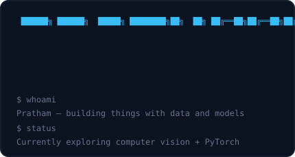
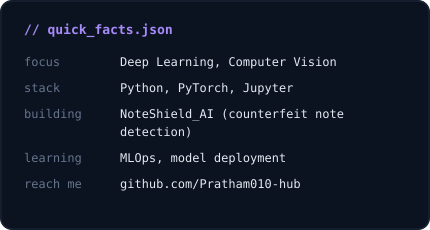

 

<table align="center">
<tr>
<td></td>
<td></td>
</tr>
</table>

 

### 🛠️ Tech I work with

  
  
  
  
  
  

### 📌 Featured project

  

### 📊 GitHub stats

  
  

### 🐍 Contribution graph

  

  

